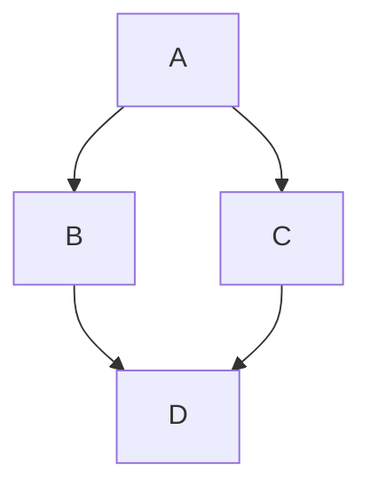

# Markdown Cheatsheet

## Headings

# A first-level heading
## A second-level heading
### A third-level heading

## Styling text

**This is bold text**, __This is bold text__\
*This is italicized*, _This is italicized_\
~~This was mistaken text~~, ~This was mistaken text~\
**This text is _extremely_ important**\
***All this text is important***\
This is a <sub>subscript</sub> text\
This is a <sup>superscript</sup> text\
This is an <ins>underlined</ins> text

## Quoting text

Text that is not a quote
> Text that is a quote

## Quoting code

Use `git status` to list all new or modified files that haven't yet been committed.\
Some basic Git commands are:
```
git status
git add
git commit
```

## Links

This site was built using [GitHub Pages](https://pages.github.com/).

## Relative links

[Contribution guidelines for this project](docs/CONTRIBUTING.md)

## Custom anchors

<a name="my-custom-anchor-point"></a>
Some text I want to provide a direct link to, but which doesn't have its own heading.

[A link to that custom anchor](#my-custom-anchor-point)

## Line breaks

Include two spaces  
at the end of the first line.

Incldue a backslash\
at the end of the first line.

Include a HTML single line break tag<br/>
at the end of the first line.

## Images


## Lists

- George Washington
* John Adams
+ Thomas Jeffereson

1. James Madison
2. James Monroe
3. John Quincy Adams

## Nested Lists

1. First list item
   - First nested list item
     - Second nested list item

100. Second list item
     - First nested list item
       - Second nested list item

## Task lists

- [x] #739
- [ ] https://github.com/octo-org/octo-repo/issues/740
- [ ] Add delight to the experience when all tasks are complete :tada:
- [ ] \(Optional) Open a followup issue

## Mentioning people and teams

@github/support What do you think about these updates?

## Using emojis

@octocat :+1: This PR looks great - it's ready to merge! :shipit:

## Paragraphs

You can create a new paragraph by leaving a blank line between lines of text.

## Footnotes

Here is a simple footnote[^1].

A footnote can also have multiple lines[^2].

[^1]: My reference.
[^2]: To add line breaks within a footnote, add 2 spaces to the end of a line.  
This is a second line.

## Alerts

> [!NOTE]
> Useful information that user should know, even when skimming content.

> [!TIP]
> Helpful advice for doing things better or more easily.

> [!IMPORTANT]
> Key information users need to know to achieve their goal.

> [!WARNING]
> Urgent info that needs immediate user attention to avoid problems.

> [!CAUTION]
> Advises about risks or negative outcomes of certain actions.

## Hiding content with comments

<!-- This content will not appear in the rendered Markdown -->

## Ignoring Markdown formatting

Let's rename \*our-new-project\* to \*our-old-project\*.

## Tables

| First Header  | Second Header |
| ------------- | ------------- |
| Content Cell  | Content Cell  |
| Content Cell  | Content Cell  |

| Command | Description |
| --- | --- |
| git status | List all new or modified files |
| git diff | Show file differences that haven't been staged |

## Formatting content within your table

| Command | Description |
| --- | --- |
| `git status` | List all *new or modified* files |
| `git diff` | Show file differences that **haven't been** staged |

| Left-aligned | Center-aligned | Right-aligned |
| :---         |     :---:      |          ---: |
| git status   | git status     | git status    |
| git diff     | git diff       | git diff      |

| Name     | Character |
| ---      | ---       |
| Backtick | `         |
| Pipe     | \|        |

## Collapsed sections

<details>
<summary>Tips for collapsed sections</summary>

### You can add a header

You can add text within a collapsed section.

You can add an image or a code block, too.

```ruby
puts "Hello World"
```

</details>

<details open>
<summary>Label</summary>

Body

</details>

## Code blocks

````
```
Look! You can see my backticks.
```
````

```ruby
require 'redcarpet'
markdown = Redcarpet.new("Hello Word!")
puts markdown.to_html
```

## Mermaid diagrams



```mermaid
info
```

## Mathematical expressions

This sentence uses `$` delimiters to show math inline: $\sqrt{3x-1}+(1+x)^2$

This sentence uses $\` and \`$ delimiters to show math inline: $`\sqrt{3x-1}+(1+x)^2`$

**The Cauchy-Schwarz Inequality**\
$$\left( \sum_{k=1}^n a_k b_k \right)^2 \leq \left( \sum_{k=1}^n a_k^2 \right) \left( \sum_{k=1}^n b_k^2 \right)$$

**The Cauchy-Schwarz Inequality**

```math
\left( \sum_{k=1}^n a_k b_k \right)^2 \leq \left( \sum_{k=1}^n a_k^2 \right) \left( \sum_{k=1}^n b_k^2 \right)
```

This expression uses `\$` to display a dollar sign: $`\sqrt{\$4}`$\
within a math expression.

To split <span>$</span>100 in half, we calculate $100/2$\
outside a math expression, but on the same line.

---
## References

- [Basic writing and formatting syntax](https://docs.github.com/en/get-started/writing-on-github/getting-started-with-writing-and-formatting-on-github/basic-writing-and-formatting-syntax)
- [Working with advanced formatting/Organizing infromation with tables](https://docs.github.com/en/get-started/writing-on-github/working-with-advanced-formatting/organizing-information-with-tables)
- [Work with advanced formatting/Organizing information with collapsed sections](https://docs.github.com/en/get-started/writing-on-github/working-with-advanced-formatting/organizing-information-with-collapsed-sections)
- [Working with advanced formatting/Creating and highlighting code blocks](https://docs.github.com/en/get-started/writing-on-github/working-with-advanced-formatting/creating-and-highlighting-code-blocks)
- [Working with advanced formatting/Creating diagrams](https://docs.github.com/en/get-started/writing-on-github/working-with-advanced-formatting/creating-diagrams)
- [Working with advanced formatting/Writing mathematical expressions](https://docs.github.com/en/get-started/writing-on-github/working-with-advanced-formatting/writing-mathematical-expressions)
